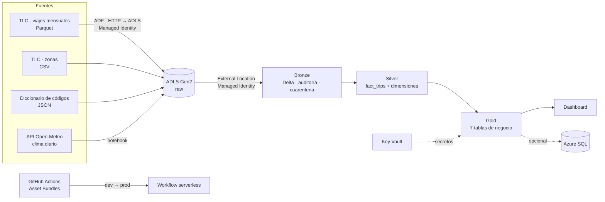

# 🚕 NYC Taxi Medallion: ETL en Azure Databricks

Pipeline de ingeniería de datos sobre los **viajes reales de taxi amarillo de Nueva York**
(TLC Trip Record Data, ~3,5 millones de viajes por mes) que integra cuatro fuentes heterogéneas
(Parquet, CSV, JSON y una API REST) para analizar demanda, rentabilidad, propinas, el efecto del
clima y el impacto del **cobro por congestión** que Nueva York implementó el 5 de enero de 2025.

Arquitectura **Medallion (Raw → Bronze → Silver → Gold)** sobre **Unity Catalog**, acceso al Data
Lake solo por **Managed Identity**, **100 % Python/PySpark** (sin Spark SQL), cargas incrementales
idempotentes por mes, manejo de **schema drift**, **cuarentena** de registros inválidos y
**CI/CD con Databricks Asset Bundles + GitHub Actions**.

---

## 🎯 Preguntas de negocio

| # | Pregunta | Tabla Gold |
|---|---|---|
| 1 | ¿Cómo evoluciona la demanda diaria por distrito? | `trips_daily` |
| 2 | ¿En qué días y horas hay más demanda y más congestión? | `hourly_demand` |
| 3 | ¿Qué zonas generan más viajes e ingresos? | `zone_performance` |
| 4 | ¿Cuáles son las rutas más frecuentes y cuánto cuestan por milla? | `top_routes` |
| 5 | ¿Cómo pagan los pasajeros y cuánta propina dejan? | `payment_tips` |
| 6 | ¿Qué efecto tuvo el cobro por congestión en viajes, ingresos y velocidad en Manhattan? | `congestion_pricing_monthly` |
| 7 | ¿La lluvia y la nieve cambian la demanda y las propinas? | `weather_impact` |

---

## 🏛️ Arquitectura

<!-- Reemplazar por el diagrama propio exportado a evidencias/arquitectura.png -->



| Servicio | Uso |
|---|---|
| ADLS Gen2 | Contenedores `raw`, `bronze`, `silver`, `gold`, `catalog` |
| Access Connector (Managed Identity) | Única vía de acceso al Data Lake (`cred_nyctaxi_mi`) |
| Azure Databricks (dev y prod) | Unity Catalog, notebooks PySpark, workflow serverless |
| Azure Data Factory | Copia los Parquet mensuales desde el sitio de la TLC a `raw` |
| Azure Key Vault | Secret scope `kv-nyctaxi` (credenciales de Azure SQL) |
| Azure SQL Database (opcional) | Destino de las tablas Gold |
| GitHub Actions + Asset Bundles | CI/CD dev → prod con aprobación manual |

---

## 📥 Fuentes (4 insumos)

| Insumo | Formato | Tabla Bronze | Carga |
|---|---|---|---|
| Viajes de taxi amarillo (TLC) | Parquet mensual | `yellow_trips` (particionada por mes) | Incremental, `replaceWhere` por mes |
| Zonas de taxi (TLC) | CSV | `taxi_zones` | MERGE |
| Códigos del diccionario TLC | JSON Lines | `ref_codes` | MERGE |
| Clima diario NYC (Open-Meteo) | JSON vía API REST | `weather_daily` | API → raw → MERGE |

Detalles de descarga en [`datasets/README.md`](datasets/README.md).

---

## 📂 Estructura del repositorio

```
├── .github/workflows/cicd.yml        CI/CD: validar → deploy dev → aprobación → deploy prod + ejecución
├── databricks.yml                    Asset Bundle: workflow como código (targets dev y prod)
├── PrepAmb/01_prep_ambiente.py       Storage credential (Managed Identity), external locations, catálogos
├── proceso/                          ÚNICOS notebooks desplegados y ejecutados en prod
│   ├── utils/common.py               Lectura, schema drift, calidad, MERGE, replaceWhere, logs
│   ├── 00_prep_ambiente.py           Catálogo/esquemas (SDK) y tablas Bronze (Delta builder)
│   ├── 01_ingest_trips.py            Parquet → bronze.yellow_trips
│   ├── 01_ingest_zones.py            CSV → bronze.taxi_zones
│   ├── 01_ingest_reference.py        JSON → bronze.ref_codes
│   ├── 01_ingest_weather.py          API → raw → bronze.weather_daily
│   ├── 02_transform_dimensiones.py   dim_zone, dim_reference, dim_date (+ clima)
│   ├── 02_transform_trips.py         fact_trips enriquecida y con banderas de calidad
│   ├── 03_load_gold.py               7 tablas de negocio
│   ├── 04_export_azure_sql.py        (opcional) Gold → Azure SQL con secretos de Key Vault
│   └── 05_grants.py                  Permisos de mínimo privilegio (SDK)
├── seguridad/01_grupos_y_grants.py   Grants dev y prod
├── reversion/01_drop_objetos.py      Elimina objetos lógicos (SDK)
├── reversion/02_borrar_rutas_fisicas.py  Borra archivos en ADLS
├── datasets/                         Descripción de insumos y códigos de referencia (JSON)
├── dashboard/                        .pbix / .json, capturas y enlace
├── certificaciones/                  Certificaciones (.png + enlace)
└── evidencias/                       Capturas de ejecución y recursos
```

---

## 🔄 Workflow `WF_prod_ETL_NYC_TAXI`

```
                ┌─ ingest_trips ──────────────────────────────────┐
prep_ambiente ──┼─ ingest_zones ─────┐                            ├─ transform_trips ─ load_gold ─┬─ export_azure_sql
                ├─ ingest_reference ─┼─ transform_dimensiones ────┘                               └─ grants
                └─ ingest_weather ───┘
```

- Parámetro `p_months` (por defecto `2024-12,2025-01,2025-02`): un mes **antes** y dos **después** del
  cobro por congestión. Agregar un mes nuevo solo procesa ese mes; re-ejecutar no duplica.
- Cómputo **serverless**; dev nunca ejecuta. Reintentos en ingestas, timeout de 4 h, alerta por correo.
- Programado el día 15 de cada mes (la TLC publica con ~2 meses de retraso).

<!--  -->

---

## 🧪 Calidad de datos

**Bronze: reglas duras → `bronze.quarantine`**

| Regla | Problema real que detecta |
|---|---|
| Fechas y zonas obligatorias | Registros incompletos |
| Llegada posterior a la salida | Relojes del taxímetro mal sincronizados |
| Fecha de recogida dentro del mes del archivo | Viajes con fechas de otros años dentro del archivo mensual |
| Tarifa, total y distancia ≥ 0 | Reembolsos y anulaciones con montos negativos |
| Zonas entre 1 y 265 | Identificadores de zona inválidos |

**Silver: reglas blandas → banderas** (no se borran; Gold las excluye de los promedios)

`flag_long_duration` (> 3 h) · `flag_zero_distance` (distancia 0 con cobro) · `flag_high_speed`
(> 80 mph) · `flag_extreme_fare` (> 500 USD) · `flag_unknown_zone` (zonas 264/265) → `is_suspicious`

**Además:** schema drift entre meses (`Airport_fee`/`airport_fee`, tipos distintos, `cbd_congestion_fee`
solo desde 2025) · duplicados exactos eliminados con un `trip_id` determinístico (SHA-256) ·
pasajeros 0 → desconocido · métricas por ejecución en `audit.data_quality_log`.

<!--  -->

---

## 🥈 Modelo Silver

| Tabla | Grano | Columnas destacadas |
|---|---|---|
| `fact_trips` | viaje | zonas y distritos de origen/destino, duración, velocidad, km, `tip_pct`, `has_cbd_fee`, `is_airport_trip`, banderas |
| `dim_zone` | zona TLC | `borough`, `zone`, `is_airport`, `is_yellow_zone`, `is_unknown` |
| `dim_reference` | código | descripciones en español de proveedor, tarifa y forma de pago |
| `dim_date` | día | calendario generado con PySpark + temperatura, precipitación, nieve, `weather_condition` |

## 🥇 Técnicas PySpark aplicadas

Widgets y parámetros de job · `StructType` · lectura `abfss://` vía external location · normalización
de schema drift · `PERMISSIVE` + `_corrupt_record` · `requests` + `dbutils.fs.put` (API → raw) ·
`arrays_zip` + `explode` · `sequence` para el calendario · `create_map` · `sha2` · joins con
`broadcast` · `when/otherwise` · `groupBy/agg` · window functions (`dense_rank`, `row_number`,
`lag`, sumas por partición) · Delta `MERGE`, `replaceWhere`, `createIfNotExists`, `ZORDER` ·
secret scopes con Key Vault · `dbutils.notebook.exit` con métricas JSON · `%run` para reutilizar código.

---

## 🔐 Seguridad

- Data Lake accesible solo con **Managed Identity** (Access Connector → storage credential → external locations).
- Sin secretos en el código: Azure SQL vía Key Vault; CI/CD vía **OIDC**.
- Grupos con mínimo privilegio (`grp_data_engineers`, `grp_data_analysts`, `grp_bi_readers`) aplicados con el **Databricks SDK**.
- En prod solo escribe el **service principal** del pipeline (`run_as`).
- El dataset no contiene datos personales (sin nombres, placas ni coordenadas exactas).

---

## 🚀 Despliegue

1. **Azure:** ADLS Gen2 (contenedores `raw`, `bronze`, `silver`, `gold`, `catalog`), dos workspaces
   Databricks Premium (dev/prod, misma región), Access Connector con *Storage Blob Data Contributor*,
   Key Vault y Data Factory.
2. **Datos:** copiar a `raw/nyc_taxi/` según [`datasets/README.md`](datasets/README.md).
3. **Unity Catalog:** ejecutar `PrepAmb/01_prep_ambiente.py`, crear los grupos y ejecutar `seguridad/01_grupos_y_grants.py`.
4. **GitHub:** service principal con *federation policy* (OIDC); environments `dev` y `prod`
   (este con *Required reviewers*) con `DATABRICKS_HOST` y `DATABRICKS_CLIENT_ID`; completar `databricks.yml`.
5. **Ejecutar:** `git push origin main` → validar → deploy dev → aprobación → deploy prod → workflow.
6. **Revertir:** `reversion/01_drop_objetos.py` y `reversion/02_borrar_rutas_fisicas.py` con `p_confirm = SI_BORRAR`.

---

## 📊 Dashboard

<!-- Capturas en dashboard/ y enlace en dashboard/enlace.txt -->
KPIs (viajes, ingresos, ticket promedio, % propina) · tendencia diaria con clima · mapa de calor
día × hora · ranking de zonas · rutas principales · antes/después del cobro por congestión.

## 📌 Hallazgos

<!-- Completar con los resultados reales de prod, por ejemplo:
- El cobro por congestión se aplicó al X % de los viajes de enero y recaudó Y USD.
- La velocidad promedio en Manhattan pasó de A a B mph.
- Los días de nieve tuvieron Z % menos viajes. -->

---

## ✅ Evidencias

| Evidencia | Archivo |
|---|---|
| Recursos en Azure | `evidencias/azure_recursos.png` |
| Storage credential y external locations (Managed Identity) | `evidencias/unity_catalog.png` |
| Pipeline de ADF exitoso | `evidencias/adf_pipeline.png` |
| GitHub Actions exitoso | `evidencias/github_actions.png` |
| Workflow de producción exitoso | `evidencias/workflow_prod.png` |
| Historial Delta (cargas incrementales) | `evidencias/describe_history.png` |
| Cuarentena y log de calidad | `evidencias/quarantine.png` |
| Grants aplicados | `evidencias/grants.png` |

---

## ⚠️ Supuestos y limitaciones

- La TLC publica los datos tal como los reportan los proveedores y no garantiza su exactitud.
- Las propinas en efectivo no se registran: `tip_pct` solo se calcula para pagos con tarjeta.
- El clima se toma de un único punto (Manhattan) para toda la ciudad.
- Las horas se almacenan como hora local de Nueva York, tal como vienen en los archivos.

## 💰 Costos

Cómputo serverless solo durante la ejecución del workflow; dev no ejecuta. Recursos eliminados con
`reversion/` al finalizar la evaluación.

---

## 👤 Autor

**José Ignacio Jaraba Atehortúa** · Trabajo final · Ingeniería de Datos con Databricks
